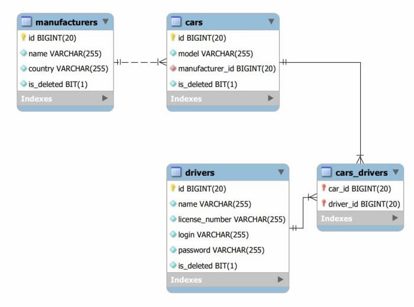

#   <u>&euro;   Little taxi - Your taxi service! &euro;</u>  

*Welcome to my first application)

Image what you are a happy owner of little taxi service, so I'm create this 
web application especially for you! You have some vehicles for your service 
and some drivers who use it. To manage which driver uses which car, 
they run this application:

[https://little-taxi.herokuapp.com/](https://little-taxi.herokuapp.com/)

We know what driver **Vasil** use 
  * login *vasil* 
and 
  * password *1234*
   
It is a very bad practice, please never do that! 
But we can use this credentials and find out how 

# The application uses for:
  
  * Login and logout
  * Display list of all drivers
  * Display list of all cars
  * Display list of cars manufacturers
  * Create (register) a new driver account with name and license number
  * Delete driver from list
  * Create a new car with model and manufacturer
  * Delete car from list
  * Create new manufacturer with name and country
  * Delete manufacturer from list
  * Add some driver to some car
  * Display list of cars for current driver

Feel free to create cars, manufacturers and drivers. Also you can delete it. Please, do not delete all of it, may be someone else wants to use this useful application) If you want to become a hacker, you can try to bruteforce a credentials 
for other drivers. I think, it's likes of Vasyl credentials)
But if you wanna became a Java developer, like me, you will be interested how the project work.

# Project description

Little taxi project realized in Java language plus basic HTML. All SOLID principles are used for writing this program. Also was used this technologies: Java 11 JRE and Intellij IDEA as JDK, Apache Tomcat 9 as Webserver, MySQL 8 server as database management system and MySQL Workbench as a shell, Apache Maven 3.8 as development tool package, JSTL 1.2 as tag library, Java Servlet 4 as layer between HTTP protocol and Java program, Dependency Injector as inner program technology and a HTTP + CSS for presentation tier implementation.
Project implements three-layer based architecture:

  * **DAO** - data access Tier
  * **Service** - business Tier
  * **Controllers** - presentation Tier

# This is a database structure

OK, you can use my code, it's free, to create your own application. To run program locally, first fork this project and download code from forked repository

[Little taxi project](https://github.com/LowPassenger/little-taxi)

  * Must have: JDK (Intellij IDEA Ultimate, Eclipse e.t.c), Git, Apache Maven, Apache Tomcat, Apache log4j2, MySQL or any other server and (optional) MySQL Workbench. Use guides and Google search for troubleshoot apps installation issues.
  * Create a database, use init_db.sql from 
*src/main/resources/*
  * Establish database connection, use credentials from SQL - login, password, path to your database and your JDBC driver in ConnectionUtil.java file
*src/main/java/taxi/util/*
  * Add TomcatLocal to JDK configuration. Use default port 8080. Do not forget to specify Tomcat installation folder and select taxi_service:war exploded in the fix window, also change the initial path from */web_security_war_exploded* to */* 
  * Configure inner logger, use log4j2.xml file from
*src/main/resources/*
  * Standart path to log file is 
*logs/*
  * Maybe you need change it to absolute path like "*D:/Projects/Taxi/logs/*"
  * Feel free to change log messages and log levels for messages in your code. 

